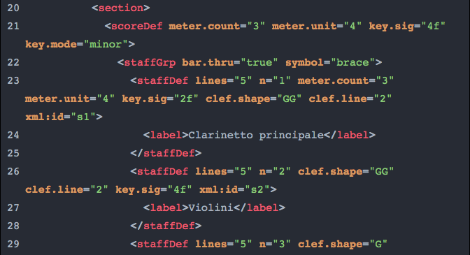
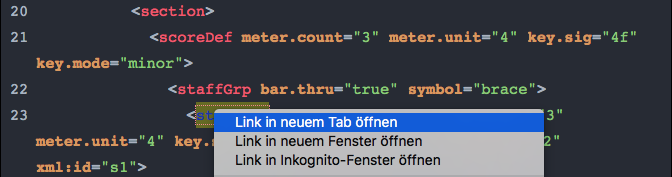

# mei-doc-link

 <!-- TOC START min:1 max:3 link:true asterisk:false update:true -->
- [mei-doc-link](#mei-doc-link)
  - [MEI Documentation Links](#mei-documentation-links)
  - [Usage](#usage)
    - [Overview](#overview)
    - [Query selector options](#query-selector-options)
    - [Language options](#language-options)
    - [What elements will be linked?](#what-elements-will-be-linked)
    - [Examples](#examples)
  - [To Do](#to-do)
  - [License](#license)
<!-- TOC END -->


## MEI Documentation Links
Provides automatic linking of element names in code snippets to their respective page within the MEI-XML documentation using JavaScript.

Also works, of course, in the context of “normal” web pages, e.g. see live demo [here](https://hou2zi0.github.io/mei-doc-link/examples/example.html).

It also provides a simple CSS stylesheet to mimic the Atom dark theme. The classes used by the CSS are applied by JavaScript and are as follows:

* `span.delimiters`
* `span.element`
* `span.attribute`
* `span.value`
* `span.comment-string`
* `a.mei-doc-link`
* `code.xml.mei-doc-link`

When `lineNumbering` is set to `true`, the following markup applies as well:

* `span.line-numbering`
* `span.code-line`

N.B.: Third party libraries may provide their own markup and classes. Thus there’s a possibility that the CSS gets scrambled, when too many libraries work on the codes snippets.

N.b.: The file in the `JS` folder is going to be (mostly) stable. Development work will be carried out in `dev`.

## Usage
### Overview
Include the JavaScript file at the bottom of your HTML page.  Just before that, you may provide the class names of the code snippets, where you want to link to the TEI documentation in the constant variable `MEI_DOC_LINK` .

N.b.: by default the CSS and the JS files
* expect the classes `xml mei-doc-link` on the element `<code>`
* and apply the `document.getElementsByClassName()` selector method.

When `MEI_DOC_LINK` is not provided, it will be  set as `xml mei-doc-link` automatically. You may switch to the `document.querySelectorAll()` selector method by setting the `querySelectorAll` property in `MEI_DOC_LINK_CONFIG` to `true` (see below). When you switch the selector method, you must also provide a valid query in `MEI_DOC_LINK`, e.g. `pre code.xml.highlight`.

```html
<html>
  <head>
    <link rel="stylesheet" href="https://hou2zi0.github.io/mei-doc-link/CSS/mei-documentation-links.css" />
  </head>
  <body>
    <pre><code class="xml mei-doc-link">&lt;note pname=&quot;b&quot; oct=&quot;4&quot; dur=&quot;8&quot; xml:id=&quot;m259_s1_n1&quot; artic=&quot;acc&quot;/&gt;</code></pre>
  […]
    <script>
      const MEI_DOC_LINK = `xml mei-doc-link`;
      const MEI_DOC_LINK_CONFIG = {
        "querySelectorAll": false,
        "lineNumbering": true
      }
    </script>
      <script type="text/javascript" src="https://hou2zi0.github.io/mei-doc-link/JS/mei-documentation-links.js"></script>
  </body>
</html>
```

### Query selector options

To switch to the `document.querySelectorAll()` selector method set `MEI_DOC_LINK_CONFIG.querySelectorAll = true`. Don’t forget to provide a valid query, e.g. `pre code.xml.highlight`.

```html
<script>
  const MEI_DOC_LINK = `pre code.xml.highlight`;
  const MEI_DOC_LINK_CONFIG = {
    "querySelectorAll": true
  }
</script>
```

### Language options

No language options available yet, because afaik the MEI documentation is currently only available in English.

May me implemented as shown [here](https://github.com/hou2zi0/tei-doc-link#language-options).


### What elements will be linked?

Every element name recognized as such by the regular expression will be linked to its assumed MEI documentation page, regardless of its actual existence.

Attribute names are not yet linked to their respective pages, because these pages do not exist yet in the documentation and linking to the attributes section within their respective element’s documentation page is not possible, because of missing IDs.

It may however be implemented as shown [here](https://github.com/hou2zi0/tei-doc-link#what-elements-and-attributes-will-be-linked).


### Examples

When it works, it should look like this:





The simple example shows the built-in line numbering feature.  The corresponding live example may be found  [here](https://hou2zi0.github.io/mei-doc-link/examples/example.html).

## To Do

* Provide possibility to switch between languages of TEI documentation (via “Configuration object”), as soon as  multi language documentation is available.
* Link attribute names to their respective url fragments or IDs, when available.
* Refactor to a more formal functional style.

## License

The software is published under the terms of the MIT license.

Copyright 2019 Max Grüntgens

Permission is hereby granted, free of charge, to any person obtaining a copy of this software and associated documentation files (the "Software"), to deal in the Software without restriction, including without limitation the rights to use, copy, modify, merge, publish, distribute, sublicense, and/or sell copies of the Software, and to permit persons to whom the Software is furnished to do so, subject to the following conditions:

The above copyright notice and this permission notice shall be included in all copies or substantial portions of the Software.

THE SOFTWARE IS PROVIDED “AS IS”, WITHOUT WARRANTY OF ANY KIND, EXPRESS OR IMPLIED, INCLUDING BUT NOT LIMITED TO THE WARRANTIES OF MERCHANTABILITY, FITNESS FOR A PARTICULAR PURPOSE AND NONINFRINGEMENT. IN NO EVENT SHALL THE AUTHORS OR COPYRIGHT HOLDERS BE LIABLE FOR ANY CLAIM, DAMAGES OR OTHER LIABILITY, WHETHER IN AN ACTION OF CONTRACT, TORT OR OTHERWISE, ARISING FROM, OUT OF OR IN CONNECTION WITH THE SOFTWARE OR THE USE OR OTHER DEALINGS IN THE SOFTWARE.
